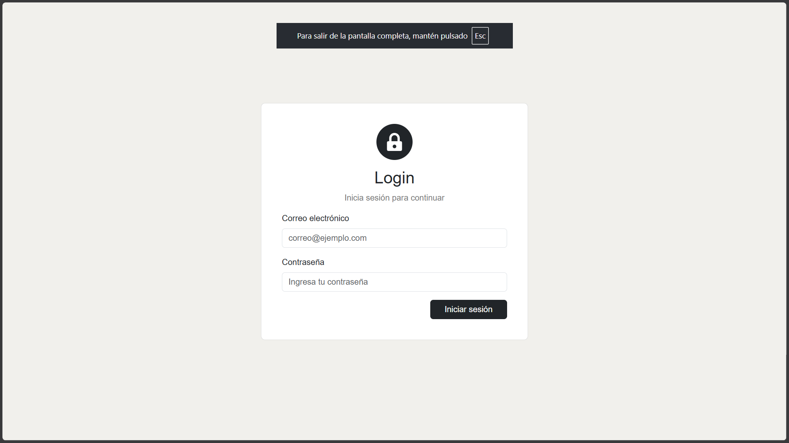
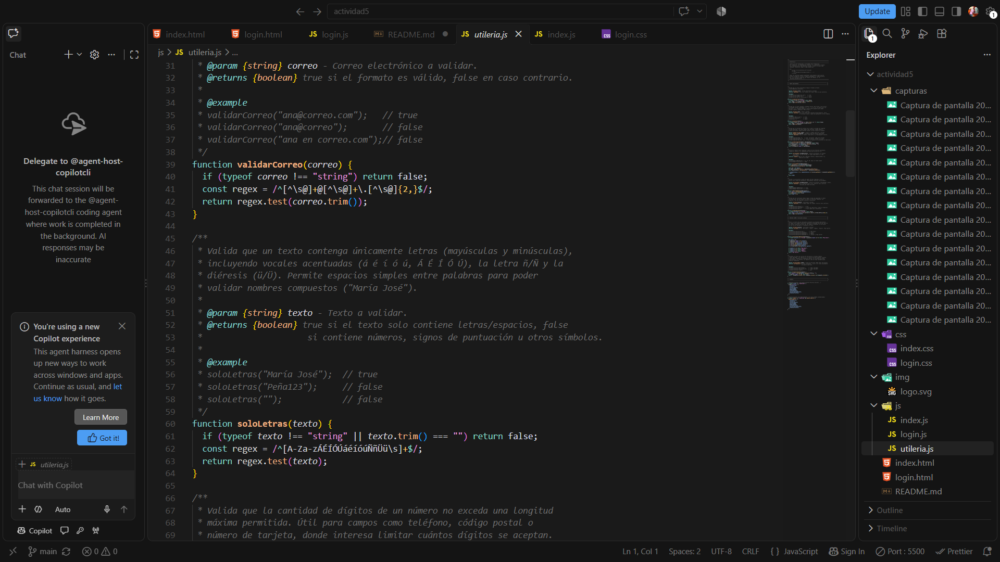
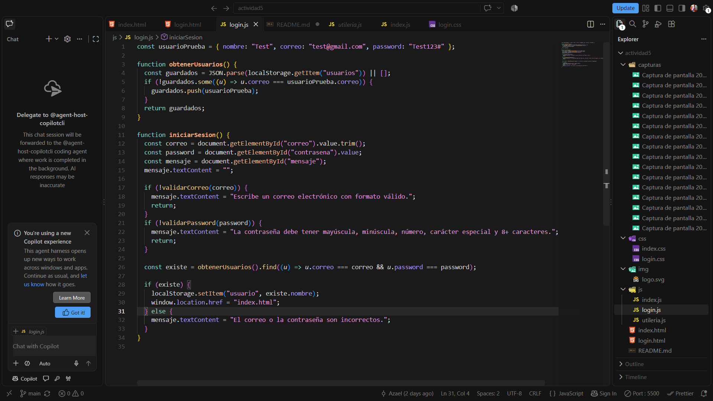

# Actividad 5. Proyecto de Login

## Portada

| Campo        | Detalle                                          |
| ------------ | ------------------------------------------------ |
| Proyecto     | Proyecto de Login                                |
| Materia      | Programación Web                                 |
| Actividad    | Actividad 5                                      |
| GitHub Pages | `https://azalorenzo.github.io/Actividad5_login/` |

### Integrantes del equipo

- ANGEL OMAR SANTOS RIOS
- AZAEL CHAVEZ LORENZO

### Descripción breve

Sistema web de gestión escolar que cuenta con un login con validaciones, un navbar que muestra el usuario que inició sesión, una sidebar que se puede abrir y cerrar, captura de usuarios y registro de alumnos con cálculo de edad. Los datos se guardan en `localStorage`, por lo que no se utiliza un backend. Las validaciones principales se encuentran en la librería `js/utileria.js`.

---

## Índice

1. [Framework CSS y librerías](#1-framework-css-y-librerías)
2. [Flujo login → sistema](#2-flujo-login--sistema)
3. [Cómo pasa el nombre de usuario del login al navbar](#3-cómo-pasa-el-nombre-de-usuario-del-login-al-navbar)
4. [Métodos principales](#4-métodos-principales)
5. [Proceso de creación paso a paso](#5-proceso-de-creación-paso-a-paso)
6. [Capturas del flujo completo](#6-capturas-del-flujo-completo-funcionando)
7. [Estructura del proyecto](#7-estructura-del-proyecto)
8. [Cómo ejecutarlo + usuario de prueba](#8-cómo-ejecutarlo--usuario-de-prueba)

---

## 1. Framework CSS y librerías

- **Bootstrap 5.3.3** (CDN): se utiliza para organizar el diseño y algunos elementos como el navbar, formularios, botones, tablas, menú desplegable del usuario, submenú y modal. El JavaScript de Bootstrap se carga mediante `bootstrap.bundle.min.js`.

- **Bootstrap Icons 1.11.3** (CDN): se utiliza para los iconos de Inicio, Usuarios, Alumnos y el botón para abrir y cerrar el menú.

- CSS propio:
  - `css/login.css`: contiene los estilos de la pantalla de login, como el fondo, la tarjeta centrada y el tamaño del logo.

  - `css/index.css`: contiene los estilos principales del sistema, como la distribución de la página, la sidebar, su estado cerrado, la adaptación a pantallas pequeñas y el número que aparece en el modal de edad.

- **Sin framework JS**: se utiliza JavaScript y `localStorage` para manejar las funciones del sistema.

---

## 2. Flujo login → sistema

```text
login.html → js/login.js: iniciarSesion()

  1. validarCorreo() + validarPassword()

  2. busca una coincidencia en localStorage["usuarios"]

  3. si es correcto: localStorage["usuario"] = nombre → redirect a index.html

  4. si no es correcto: muestra un mensaje de error en #mensaje

index.html → js/index.js (al cargar)

  1. lee localStorage["usuario"]

  2. si existe → muestra el nombre en #usuarioNavbar

  3. si no existe → redirect a login.html

index.html → cerrarSesion()

  1. removeItem("usuario") → redirect a login.html
```

Archivos involucrados: `login.html`, `js/login.js`, `index.html`, `js/index.js`.

---

## 3. Cómo pasa el nombre de usuario del login al navbar

Se utiliza `localStorage` para guardar y recuperar el nombre del usuario.

**1. Guardar el nombre en el login:** `js/login.js`

```js
localStorage.setItem("usuario", existe.nombre);

window.location.href = "index.html";
```

**2. Leer el nombre en el sistema:** `js/index.js`

```js
const usuario = localStorage.getItem("usuario");

if (usuario) {
  document.getElementById("usuarioNavbar").textContent = usuario;
} else {
  window.location.href = "login.html";
}
```

**3. Cerrar sesión:** `js/index.js` → `localStorage.removeItem("usuario")` y después vuelve a `login.html`.

En `index.html`, el navbar tiene un botón desplegable con `id="usuarioNavbar"`. Su texto inicial es `"Usuario"` y después se cambia por el nombre guardado.

---

## 4. Métodos principales

### 4.1 `js/utileria.js` — funciones de validación

| Método                                 | Qué hace                                                                                                               | Dónde se usa               |
| -------------------------------------- | ---------------------------------------------------------------------------------------------------------------------- | -------------------------- |
| `validarCorreo(correo)`                | Comprueba que el correo tenga un formato válido.                                                                       | Login, captura de usuarios |
| `soloLetras(texto)`                    | Comprueba que el texto tenga solo letras y espacios.                                                                   | Captura, alumnos           |
| `validarLongitud(numero, maxLongitud)` | Comprueba que la cantidad de dígitos no supere el máximo indicado.                                                     | Nº de control              |
| `calcularEdad(fechaNacimiento)`        | Calcula la edad de una persona y toma en cuenta si ya cumplió años este año.                                           | Alumnos + modal            |
| `esMayorDeEdad(fechaNacimiento)`       | Comprueba si la persona tiene 18 años o más.                                                                           | Badge del modal            |
| `validarPassword(password)`            | Comprueba que la contraseña tenga mínimo 8 caracteres, mayúscula, minúscula, número y carácter especial, sin espacios. | Login, captura             |

### 4.2 `js/login.js` — inicio de sesión

| Método                           | Qué hace                                                                                                                |
| -------------------------------- | ----------------------------------------------------------------------------------------------------------------------- |
| `obtenerUsuarios()` (`login.js`) | Obtiene los usuarios guardados en `localStorage["usuarios"]` y agrega el usuario de prueba si todavía no está.          |
| `iniciarSesion()` (`login.js`)   | Valida los datos, busca una coincidencia entre correo y contraseña, guarda el nombre del usuario y lo lleva al sistema. |

### 4.3 `js/index.js` — sistema

| Método                                                     | Qué hace                                                                                                                                            |
| ---------------------------------------------------------- | --------------------------------------------------------------------------------------------------------------------------------------------------- |
| Guardar sesión (`index.js`)                                | Comprueba que exista una sesión y muestra el nombre en `#usuarioNavbar`.                                                                            |
| `cerrarSesion()` (`index.js`)                              | Elimina la sesión y regresa al login.                                                                                                               |
| Toggle sidebar (`index.js`)                                | Abre y cierra la sidebar mediante el botón `#btnMenu`.                                                                                              |
| `mostrarVista(nombre)` (`index.js`)                        | Muestra la sección seleccionada y oculta las demás.                                                                                                 |
| `agregarFilaUsuario()` + submit `formCaptura` (`index.js`) | Valida los datos, evita correos repetidos, guarda el usuario en `localStorage["usuarios"]` y lo agrega a la tabla.                                  |
| Submit `formAlumno` + `bootstrap.Modal` (`index.js`)       | Valida el nombre, número de control y fecha, calcula la edad, agrega al alumno a la tabla y muestra el modal indicando si es mayor o menor de edad. |

---

## 5. Proceso de creación paso a paso

### Paso 1 — Login (`login.html` + `css/login.css` + `js/login.js`)

Se creó la pantalla de login con una tarjeta centrada, el logo, los campos de correo y contraseña, y un `<label id="mensaje">` para mostrar los errores. El formulario llama a `iniciarSesion()` al enviarse.


### Paso 2 — Librería de validaciones (`js/utileria.js`)

Se escribieron las funciones `validarCorreo()`, `validarPassword()`, `soloLetras()`, `validarLongitud()`, `calcularEdad()` y `esMayorDeEdad()`. Se cargan antes de `login.js` e `index.js` para poder reutilizarlas en ambas pantallas.


### Paso 3 — Lógica del login (`js/login.js`)

`iniciarSesion()` valida el formato del correo y de la contraseña, busca la coincidencia en `localStorage["usuarios"]` (junto con el usuario de prueba) y, si es correcta, guarda la sesión en `localStorage["usuario"]` y redirige a `index.html`.


### Paso 4 — Estructura del sistema (`index.html`)

Se armó el navbar con el botón hamburguesa, el logo y el menú desplegable del usuario; la sidebar con Inicio, Usuarios (submenú Captura) y Alumnos; y las tres vistas (`vista-inicio`, `vista-captura`, `vista-alumnos`), además del modal de edad.

### Paso 5 — Estilos del sistema (`css/index.css`)

Se definió el layout con `flex`, la sidebar de 240 px, la clase `sidebar-cerrada` que la oculta con `margin-left: -240px`, y el comportamiento flotante en pantallas de 768 px o menos.

### Paso 6 — Sesión, sidebar y vistas (`js/index.js`)

Se agregó la comprobación de sesión (con redirección al login si no existe), el botón que abre y cierra la sidebar, y `mostrarVista()` para alternar entre secciones usando `data-vista`.

### Paso 7 — Captura de usuarios

El formulario valida nombre, correo y contraseña con `utileria.js`, evita correos repetidos, guarda el usuario en `localStorage["usuarios"]` y lo muestra en la tabla. Al cargar la página, la tabla se reconstruye con los usuarios guardados.

### Paso 8 — Registro de alumnos y modal de edad

El formulario valida nombre, número de control (exactamente 6 dígitos) y fecha de nacimiento. Calcula la edad con `calcularEdad()`, agrega al alumno a la tabla y abre el modal con la edad y un badge verde (mayor de edad) o rojo (menor de edad).

### Paso 9 — Pruebas y publicación

Se probó todo el flujo desde `http://localhost/Actividad5_login/login.html` con XAMPP (abrir los archivos con doble clic usa `file://` y rompe `localStorage`). Después se subió el proyecto a GitHub y se publicó con GitHub Pages.

---

## 6. Capturas del flujo completo funcionando

### 6.1 Login vacío


### 6.2 Errores de validación en el login


### 6.3 Credenciales incorrectas


### 6.4 Login correcto: pantalla de Inicio con el usuario en el navbar


### 6.5 Sidebar abierta


### 6.6 Sidebar cerrada


### 6.7 Usuarios > Captura con errores de validación


### 6.8 Usuario guardado correctamente


### 6.9 Persistencia: tabla de usuarios después de recargar la página


### 6.10 Alumnos con errores de validación


### 6.11 Modal de edad: mayor de edad


### 6.12 Modal de edad: menor de edad


### 6.13 Tabla de alumnos con varios registros


### 6.14 Cerrar sesión y login con el usuario recién creado


### 6.15 Acceso protegido: abrir `index.html` sin sesión redirige al login


---
